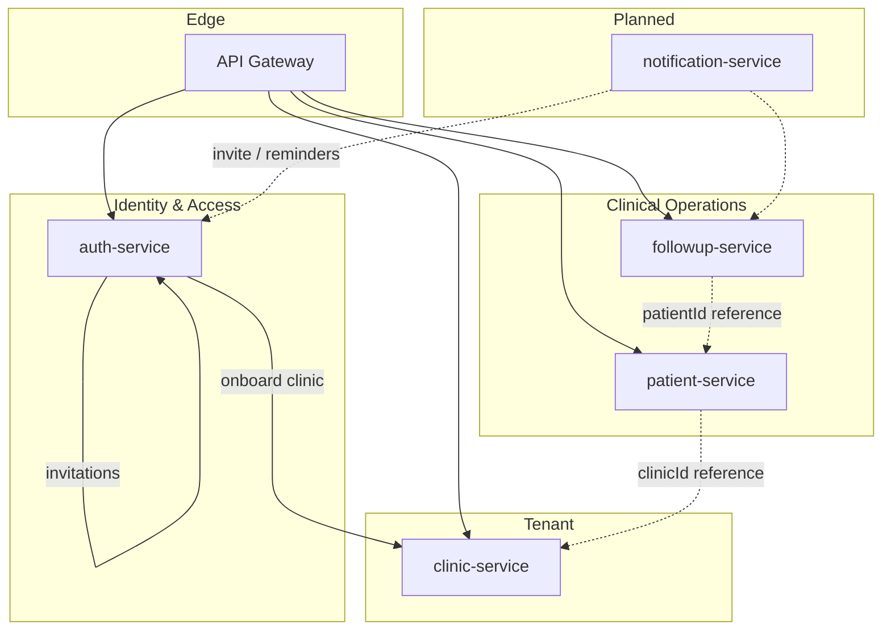

# Domain Boundaries

CareFlow uses **bounded contexts** aligned with microservices. Each service owns its data and business rules.

## Context map

## Boundaries

| Domain | Service | Owns | Does NOT own |
|--------|---------|------|--------------|
| **Identity & Access** | auth-service | Users, credentials, JWT, invitations | Clinics, patients, follow-ups |
| **Tenant** | clinic-service | Clinic aggregate, subscription plan | Users, patients |
| **Patient Management** | patient-service | Patient records per clinic | User auth, clinic config |
| **Follow-Up** | followup-service | Schedules, status, overdue rules | Patient CRUD, auth |
| **Notifications** (planned) | notification-service | Delivery (WhatsApp, email) | Business rules, user creation |

## Cross-boundary rules

1. **No shared database** — each service has its own PostgreSQL instance.
2. **No foreign keys across services** — references use UUIDs (`clinicId`, `patientId`).
3. **Gateway validates JWT** — downstream services trust propagated headers, not raw tokens.
4. **Tenant isolation** — business data filtered by `clinicId` at application layer.
5. **Onboarding orchestration** — auth-service calls clinic-service internal API for new clinics.
6. **Staff onboarding** — invitations live in auth-service; `clinicId` comes from inviter JWT, never from invite payload.

## Integration styles

| From → To | Style | Example |
|-----------|-------|---------|
| Client → Gateway | Sync REST | `POST /api/auth/login` |
| Gateway → Service | Sync REST + headers | `X-Clinic-Id` propagation |
| auth → clinic | Sync REST (internal) | `POST /internal/clinics` |
| CLINIC_ADMIN → auth | Sync REST (protected) | `POST /api/auth/invite` |
| Invited user → auth | Sync REST (public) | `POST /api/auth/register-invite` |
| followup → notification (future) | Async (RabbitMQ) | Reminder / MISSED event |

## Anti-patterns to avoid

- Patient service validating JWT directly (gateway responsibility)
- Client sending `clinicId` in request body for tenant scoping
- Shared `users` table across services
- Inviting staff by self-register with a new clinic
- Sending invite tokens from auth-service directly (notification-service responsibility)
