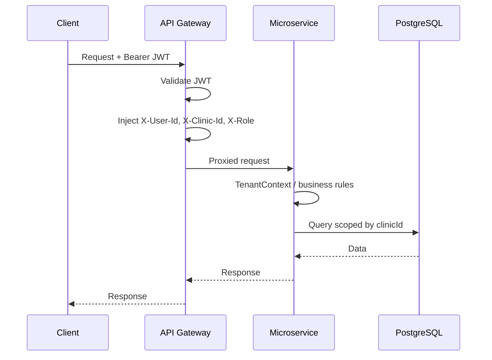
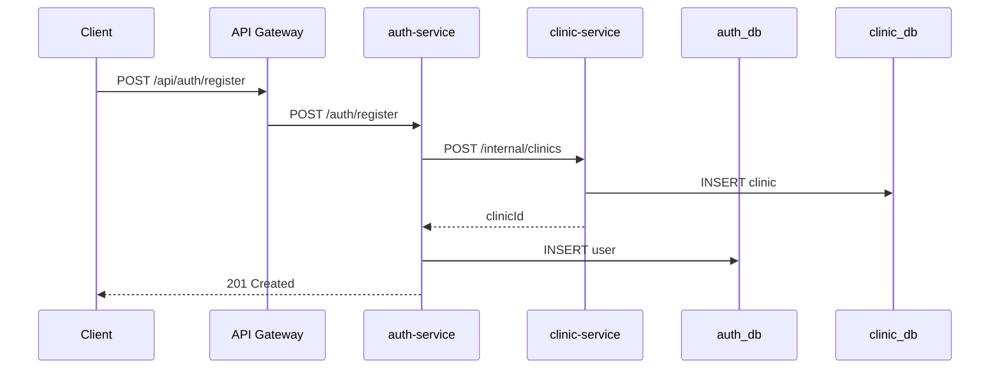
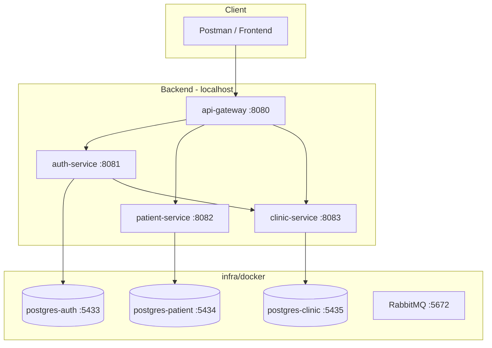

# Platform Diagram

High-level runtime architecture (MVP phase).

## Request flow — authenticated

## Request flow — CLINIC_ADMIN registration

## Deployment view (local / MVP)

## Security layers

| Layer | Responsibility |
|-------|----------------|
| API Gateway | JWT validation, public vs protected routes |
| Gateway filter | Identity header propagation, anti-spoofing |
| Downstream filter | Require trusted headers |
| Service layer | Tenant isolation, role checks |
| Internal API | `X-Internal-Api-Key` for auth → clinic onboarding |
