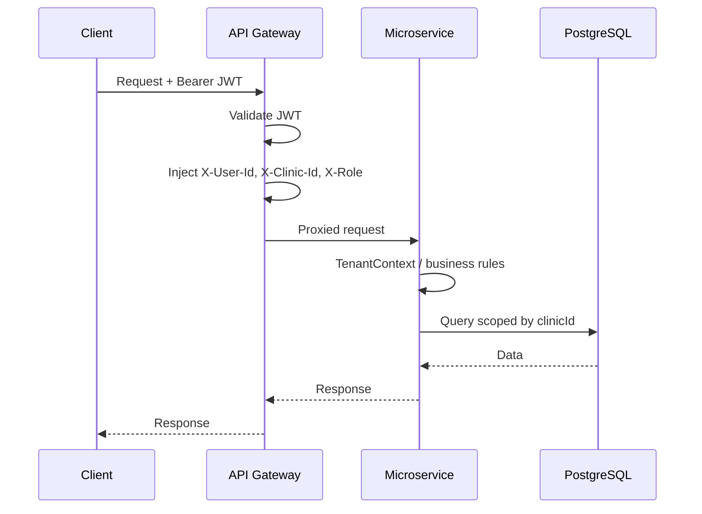
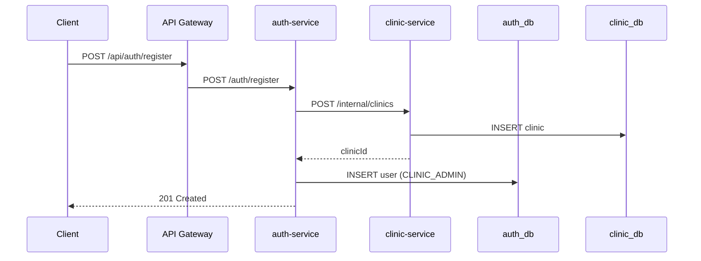
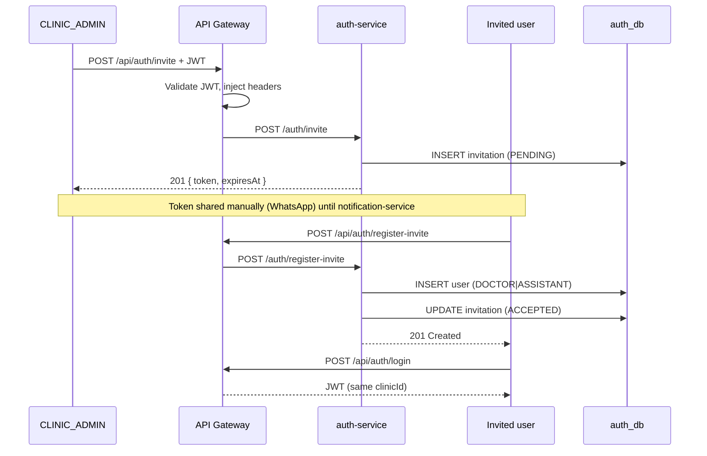
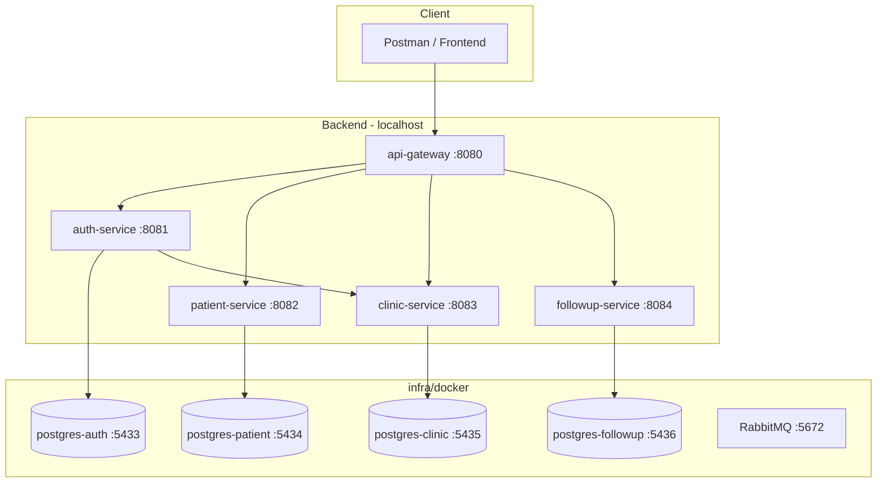

# Platform Diagram

High-level runtime architecture (MVP phase).

## Request flow — authenticated

## Request flow — CLINIC_ADMIN registration

## Request flow — staff invitation

## Deployment view (local / MVP)

## Security layers

| Layer | Responsibility |
|-------|----------------|
| API Gateway | JWT validation, granular public vs protected auth routes |
| Gateway filter | Identity header propagation, anti-spoofing |
| auth TenantContextFilter | Headers required for `/auth/invite` only |
| Downstream tenant filter | Require trusted headers on all clinical routes |
| Service layer | Tenant isolation, role checks (invite guard) |
| Internal API | `X-Internal-Api-Key` for auth → clinic onboarding |

## Gateway — public vs protected auth routes

| Route | Auth |
|-------|------|
| `/api/auth/login` | Public |
| `/api/auth/register` | Public |
| `/api/auth/register-clinic` | Public |
| `/api/auth/register-invite` | Public |
| `/api/auth/invite` | JWT required |
| `/api/patients/**`, etc. | JWT required |
