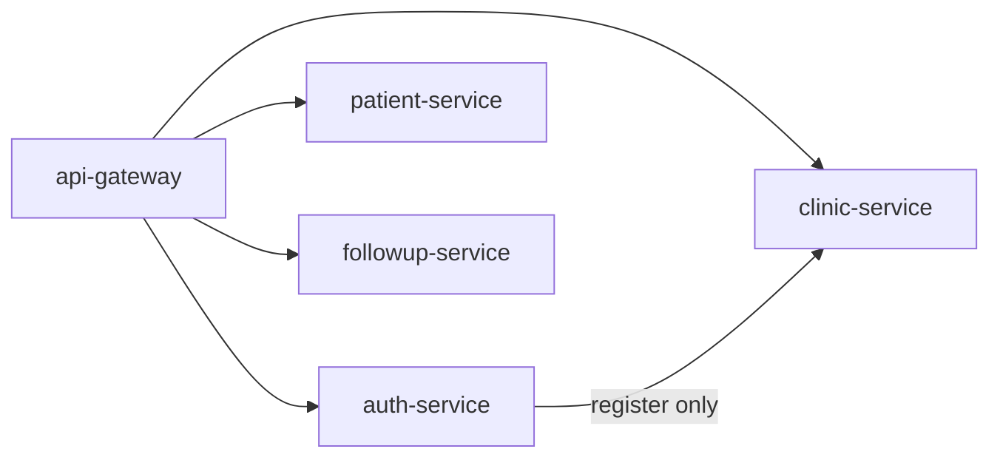

# Service Ownership

Who owns what in the CareFlow monorepo.

## Ownership matrix

| Service | Team scope | Port | Database | Public API prefix | Owner responsibilities |
|---------|------------|------|----------|-------------------|------------------------|
| **api-gateway** | Platform | 8080 | — | `/health`, `/api/**` | Routing, JWT validation, identity propagation |
| **auth-service** | Identity | 8081 | `auth_db` | `/api/auth/**` | Register, login, JWT, user credentials |
| **clinic-service** | Tenant | 8083 | `clinic_db` | `/api/clinics/**` | Clinic lifecycle, tenant metadata |
| **patient-service** | Clinical | 8082 | `patient_db` | `/api/patients/**` | Patient CRUD, clinic-scoped data |
| **followup-service** | Clinical | 8084 | `followup_db` | `/api/followups/**` | Follow-up CRUD, overdue scheduler |
| **notification-service** | Platform (planned) | TBD | TBD | internal/events | WhatsApp, delivery |

## Code ownership (monorepo)

```
backend/
├── api-gateway/      → Platform / edge
├── auth-service/     → Identity domain
├── clinic-service/   → Tenant domain
├── patient-service/  → Patient domain
└── followup-service/ → (future)

docs/
├── adr/              → Architecture decisions (shared)
├── architecture/     → System design (shared)
├── progress/         → Project memory (shared)
├── api/              → OpenAPI specs (domain owners)
└── data-model/       → Entity specs (domain owners)
```

## Decision authority

| Change type | Primary owner | Review |
|-------------|---------------|--------|
| New public endpoint | Owning service | Gateway route + docs/api |
| JWT claims / headers | api-gateway + auth-service | All downstream services |
| Tenant model | clinic-service + architecture | auth, patient, followup |
| New ADR | Whoever proposes | Document in `docs/adr/` |

## Runtime dependencies



- **patient-service** does not call auth or clinic at runtime (headers only).
- **clinic-service** does not call auth at runtime.
- **auth-service** calls clinic-service only during CLINIC_ADMIN registration.

## On-call / ops (future)

For MVP, all services deploy together via Docker Compose on a single VPS (see ADR 0001).
