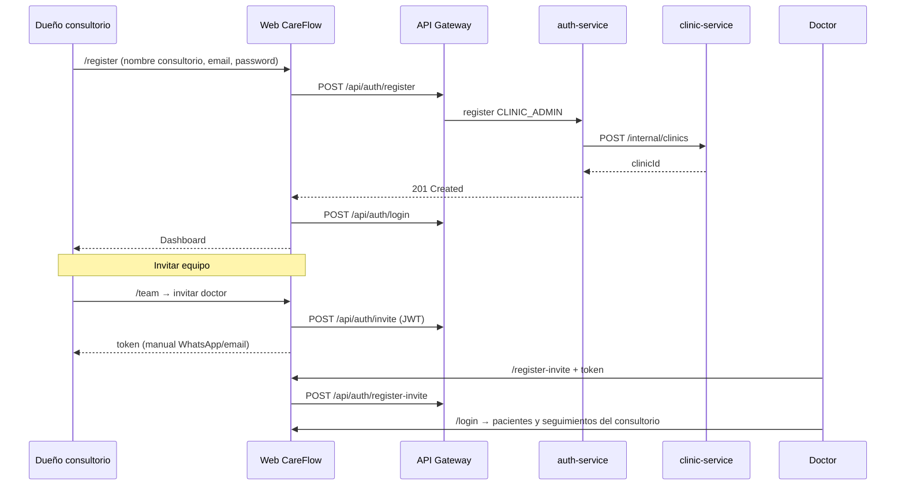

# Onboarding de consultorios — CareFlow

Modelo de alta de clientes (consultorios/clínicas) en el MVP y evolución hacia producción en la nube.

---

## ¿Quién da de alta a quién?

CareFlow tiene **dos niveles** de usuarios:

| Actor | Rol | Qué hace |
|-------|-----|----------|
| **Dueño del consultorio** | `CLINIC_ADMIN` | Registra su consultorio y administra pacientes/seguimientos/equipo |
| **Dueño de CareFlow (vos)** | `PLATFORM_ADMIN` | Gestiona la plataforma (futuro): tenants, billing, soporte |
| **Staff del consultorio** | `DOCTOR`, `ASSISTANT` | Invitados por el `CLINIC_ADMIN` |

### MVP actual: self-service

**Vos como dueño de CareFlow NO das de alta manualmente cada consultorio.**

El flujo es:

```
Dueño del consultorio → /register (público)
  → crea clínica + usuario CLINIC_ADMIN
  → login automático → dashboard

CLINIC_ADMIN → invita doctor/asistente (/team)
  → token manual → /register-invite

Staff → login → mismo consultorio (multi-tenant)
```

Esto es lo habitual en SaaS B2B early-stage: el cliente se registra solo, prueba el producto, y vos vendés/soportás después.

### Futuro (producción / enterprise)

Opciones que podés activar más adelante:

1. **`PLATFORM_ADMIN` panel** — vos creás consultorios desde un admin interno
2. **Registro con aprobación** — self-service pero queda pendiente hasta que vos apruebes
3. **Solo invitación** — desactivás `/register` público; solo clientes que vos provisionás entran
4. **Billing** — Stripe + límite de usuarios/pacientes por plan

Para demo y primeros clientes piloto, **self-service + `/register`** es suficiente.

---

## Flujo completo (diagrama)



---

## Pantallas del onboarding

| Paso | Pantalla | Estado |
|------|----------|--------|
| 1. Alta consultorio | `/register` | ✅ Implementada |
| 2. Login | `/login` | ✅ |
| 3. Dashboard operativo | `/dashboard` | ✅ |
| 4. Primer paciente | `/patients` | ✅ |
| 5. Primer seguimiento | `/followups` | ✅ |
| 6. Invitar equipo | `/team` | ✅ |
| 7. Staff acepta invite | `/register-invite` | ✅ |
| 8. Admin CareFlow (vos) | `/admin` | ❌ Futuro |

---

## Qué ve el consultorio después del alta

### Dashboard — “Requiere atención”

Bloque que muestra lo **pendiente de acción**:

- **Seguimientos vencidos** (`MISSED`) — pasó la fecha y no se completaron
- **Pacientes en riesgo** (`AT_RISK`) — marcados manualmente en pacientes

Las tarjetas de métricas enlazan a listas filtradas en `/followups?estado=...`.

### Seguimientos

- Crear, completar, cancelar
- Filtros: Todos, Pendientes, Vencidos, Completados
- El scheduler backend marca `PENDING` → `MISSED` cada 15 min si pasó `scheduledDate`

### Lo que aún NO está (PRD completo)

| Feature | Estado |
|---------|--------|
| Notificaciones WhatsApp/email | ❌ |
| Recordatorios automáticos | ❌ |
| Alertas push en tiempo real | ❌ |
| Historial por paciente | ❌ |
| RBAC fino doctor vs asistente | ❌ |
| Panel PLATFORM_ADMIN | ❌ |

---

## Local → Linux en la nube

### Fase 1 — Local (ahora)

```bash
# Infra
cd infra/docker && docker compose up -d

# Backend (5 servicios Java)
# Frontend
cd frontend && npm run dev
```

Demo desde cero: abrir `/register` → crear consultorio → operar.

### Fase 2 — Staging Linux (siguiente deploy)

En un VPS Linux (Ubuntu):

1. Docker + Docker Compose
2. Contenedores: PostgreSQL, RabbitMQ, servicios Java, frontend Next.js
3. Nginx reverse proxy + HTTPS (Let's Encrypt)
4. Variables: `CAREFLOW_JWT_SECRET`, `CAREFLOW_INTERNAL_API_KEY`, URLs de DB
5. Dominio ej. `app.careflowhq.com` → frontend, `api.careflowhq.com` → gateway

**Registro público:** dejalo abierto para pilotos o protegé con invite-only según estrategia comercial.

### Fase 3 — Producción

- Secrets en vault / env del servidor (no en repo)
- Backups PostgreSQL
- Monitoring (logs, health checks)
- Notification Service (RabbitMQ + WhatsApp API)
- Desactivar o limitar `/register` si pasás a venta enterprise

---

## Resumen para vos como dueño de CareFlow

| Pregunta | Respuesta MVP |
|----------|---------------|
| ¿Debo dar de alta yo cada consultorio? | **No** — self-service en `/register` |
| ¿Necesito un formulario? | **Sí, pero para el cliente** (dueño del consultorio), no un panel tuyo |
| ¿Cuándo entro yo? | Cuando implementemos `PLATFORM_ADMIN` (métricas globales, tenants, billing) |
| ¿Cómo demo local? | `/register` → paciente → seguimiento → dashboard “Requiere atención” |
| ¿Deploy? | Local ahora → Docker en Linux VPS después |

Ver también: [local-demo.md](../demo/local-demo.md)
